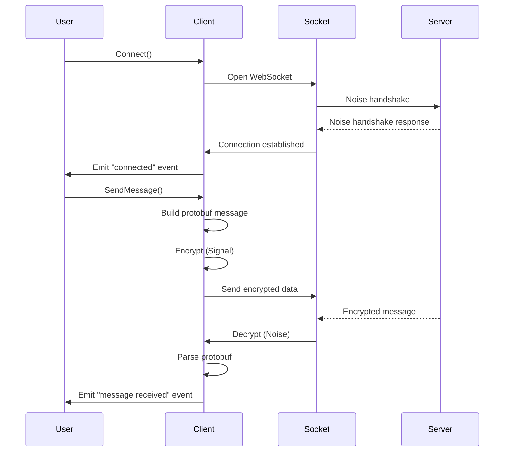

# wha.ts Architectural Overview

---

## 1. Purpose

wha.ts is a comprehensive, event-driven, end-to-end encrypted WhatsApp multi-device client library written in Go. It supports messaging, media, groups, pairing, push notifications, and more, designed to interact with WhatsApp's private protocols.

---

## 2. High-Level Architecture

- **Transport Layer:** WebSocket communication secured with the Noise protocol.
- **Encryption Layer:** Signal protocol for end-to-end encryption of messages.
- **Serialization Layer:** Protocol Buffers (protobuf) for structured data exchange.
- **Client API Layer:** The `Client` struct exposing high-level APIs.
- **Event System:** Dispatches parsed events/messages to user handlers.

---

## 3. Component Breakdown

### Client Core (`client.go`)
- Manages connection lifecycle (`Connect`, `Disconnect`, `Logout`).
- Handles Noise handshake and socket management.
- Maintains encryption state (Signal sessions, prekeys).
- Provides APIs for messaging, groups, pairing, etc.
- Dispatches events to user-registered handlers.

### Socket Layer (`socket/`)
- `NoiseSocket`: Encrypted WebSocket connection.
- `FrameSocket`: Handles framing, retries, keepalive.
- Noise protocol handshake (`handshake.go`).
- Connection event handling (`connectionevents.go`, `keepalive.go`).

### Encryption Layer
- **Signal Protocol:**
  - Prekey management (`prekeys.go`).
  - Session management.
  - Message encryption/decryption (`msgsecret.go`, `message.go`).
- **Noise Protocol:**
  - Handshake (`handshake.go`).
  - Encrypted transport (`socket/noisesocket.go`).

### Serialization Layer
- Protobuf schemas (`proto/waE2E/` and others).
- Core message type: `Message`.
- Other schemas: group info, app state, media, push, etc.
- Encoding/decoding (`binary/`).

### Messaging
- Parsing incoming messages (`message.go`).
- Building and sending messages (`send.go`, `sendfb.go`).
- Media upload/download (`upload.go`, `download.go`).
- Retry logic (`mediaretry.go`, `retry.go`).

### Groups
- Create, update, leave groups (`group.go`).
- Manage participants, invites, linked groups.

### Pairing
- QR code and phone pairing (`pair.go`, `pair-code.go`).
- Device identity verification.

### App State Sync
- Patch fetching, dispatch, sending (`appstate.go`, `appstate/`).

### Notifications & Presence
- Handle server notifications (`notification.go`).
- Manage receipts (`receipt.go`).
- Presence updates (`presence.go`).

### Push Notifications
- Register/configure push (`push.go`).

### Auxiliary
- Privacy settings (`privacysettings.go`).
- Newsletter features (`newsletter.go`).
- Call handling (`call.go`).
- Utility functions (`util/`).

---

## 4. Data Flow

```mermaid
flowchart TD
    subgraph Client
        A[User API Call] --> B[Build Protobuf Message]
        B --> C[Encrypt Message (Signal)]
        C --> D[Send via NoiseSocket]
        E[Receive Encrypted Data] --> F[Decrypt via Noise]
        F --> G[Parse Protobuf Message]
        G --> H[Dispatch Event]
    end
```

- **Outgoing:** API → protobuf → Signal encryption → Noise encryption → WebSocket.
- **Incoming:** WebSocket → Noise decryption → protobuf parsing → event dispatch.

---

## 5. Control Flow



---

## 6. Key Data Models

### `Message` (protobuf)
- Central protobuf message with optional fields for:
  - Text, image, video, audio, document, sticker, contact, location, live location.
  - Group invites, reactions, polls, ephemeral messages, payment messages.
  - Protocol messages (key exchange, sync).
  - Interactive messages (buttons, lists, templates).
  - Rich media and AI metadata.

### `Client`
- Main API object.
- Holds connection state, encryption keys, event handlers.

### `NoiseSocket`
- Encrypted WebSocket transport.

### Signal Protocol Keys
- PreKeys, SignedPreKeys, Sessions.

### Domain Models (`types/`)
- JID, MessageInfo, GroupInfo, UserInfo, Presence, Events.

### App State
- Patch, Mutation, Sync Keys.

---

## 7. Dependencies

- **Protobuf:** Data serialization.
- **Noise Protocol:** Transport encryption.
- **Signal Protocol:** End-to-end encryption.
- **HTTP:** Media upload/download.
- **WebSocket:** Persistent connection.

---

## 8. Reimplementation Considerations (TypeScript, Browser + Node.js)

- **WebSocket:** Use native WebSocket (browser) or `ws` (Node.js).
- **Crypto APIs:** Use WebCrypto (browser) and Node.js `crypto` for Noise and Signal.
- **Protobuf:** Use `protobuf.js`.
- **Binary Encoding:** Port `binary/` logic.
- **Event System:** Use EventEmitter or custom event dispatch.
- **Async/Await:** For all network and crypto operations.
- **Storage:** IndexedDB/localStorage (browser), filesystem/db (Node.js).
- **Push Notifications:** Browser push APIs, Node.js equivalents.
- **QR Code:** Canvas/SVG rendering in browser.
- **Modular Design:** Separate transport, crypto, serialization, and API layers.

---

## 9. Summary

This documentation provides a precise blueprint of wha.ts's architecture, enabling a faithful reimplementation in TypeScript compatible with both browser and Node.js environments. It covers all major components, data/control flows, key data models, and platform-specific considerations.