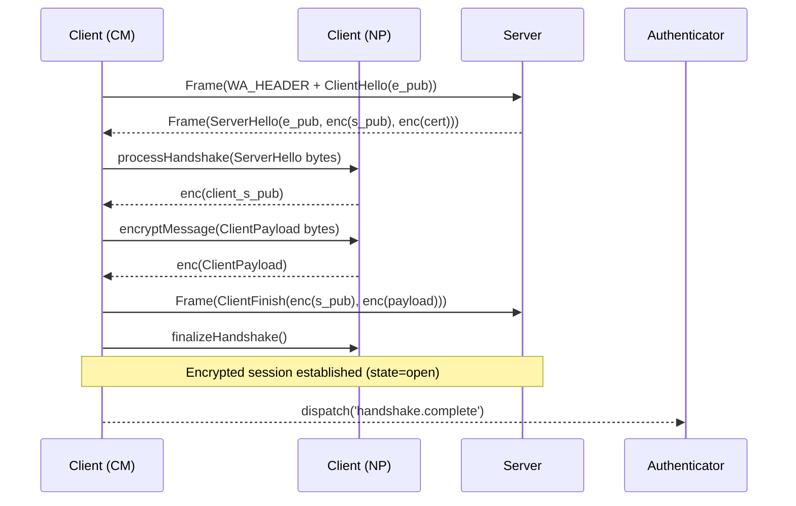

# Initial Connection & QR Code Pairing: Implementation Details

---

## Overview

This document details the **initial connection process** implemented in `wha.ts`, covering the **Noise protocol handshake** handled by `ConnectionManager` and `NoiseProcessor`, and the **QR code-based authentication workflow** managed primarily by the `Authenticator`. It explains each implemented step, the cryptographic mechanisms used, data flows, security checks performed, and error handling within the library.

---

## 1. Noise Protocol Handshake (`ConnectionManager` & `NoiseProcessor`)

### Purpose

To establish a mutually authenticated, end-to-end encrypted session over the WebSocket connection using the `Noise_XX_25519_AESGCM_SHA256` handshake pattern.

### Implemented Sequence

1.  **Connection Initiation (`ConnectionManager.connect`)**
    *   The client initiates a WebSocket connection via `NativeWebSocketClient`.
    *   `ConnectionManager` sets its state to `connecting`.

2.  **WebSocket Open (`ConnectionManager.handleWsOpen`)**
    *   Upon successful WebSocket connection, `ConnectionManager` sets state to `handshaking`.
    *   It calls `NoiseProcessor.generateInitialHandshakeMessage` to create the `ClientHello` containing the client's ephemeral X25519 public key (`creds.pairingEphemeralKeyPair.publicKey`).
    *   The `ClientHello` protobuf message is framed using `FrameHandler.framePayload` (prepends `NOISE_WA_HEADER` if not sent yet, adds 3-byte length).
    *   The framed message is sent over the WebSocket.

3.  **ServerHello Reception (`ConnectionManager.handleDecryptedFrame` -> `handleHandshakeData`)**
    *   `FrameHandler` receives data, removes the 3-byte length prefix, and passes the raw `ServerHello` bytes (still encrypted by Noise transport, but not framed) to `handleDecryptedFrame`.
    *   Since the state is `handshaking`, `handleDecryptedFrame` calls `handleHandshakeData`.
    *   `handleHandshakeData` parses the data as a `HandshakeMessage` protobuf.

4.  **ServerHello Processing (`NoiseProcessor.processHandshake`)**
    *   `handleHandshakeData` calls `NoiseProcessor.processHandshake` with the received `ServerHello` bytes.
    *   `NoiseProcessor` performs the following **XX** steps:
        *   **Mix Ephemeral Keys:** Mixes `DH(client_ephemeral_private, server_ephemeral_public)` into the Noise state (`mixKeys`).
        *   **Decrypt Server Static:** Decrypts the `serverHello.static` field using the current Noise state (`decryptMessage`).
        *   **Mix Server Static:** Mixes `DH(client_ephemeral_private, server_static_public)` into the Noise state (`mixKeys`).
        *   **Decrypt Payload (Certificate):** Decrypts the `serverHello.payload` field (`decryptMessage`).
        *   **Verify Certificate:** Parses the decrypted payload as `CertChain`. It specifically verifies that the `issuerSerial` of the `intermediate` certificate's details matches the expected WhatsApp value (`WA_CERT_DETAILS.SERIAL`). If this check fails, it throws an error. (Note: Full chain validation isn't explicitly shown, the core check is the issuer serial pinning).
        *   **Encrypt Client Static:** Encrypts the client's static Noise public key (`creds.noiseKey.publicKey`) using the current Noise state (`encryptMessage`). This becomes `clientFinish.static`.
        *   **Mix Client Static:** Mixes `DH(client_static_private, server_ephemeral_public)` into the Noise state (`mixKeys`).
    *   `processHandshake` returns the encrypted `clientFinish.static` bytes.

5.  **ClientFinish Preparation & Sending (`ConnectionManager.handleHandshakeData`)**
    *   Determines if it's a registration (no `creds.me`) or login (`creds.me` exists).
    *   Calls `generateRegisterPayload` or `generateLoginPayload` to create the appropriate `ClientPayload` protobuf containing device info, user JID (for login), or registration keys (for pairing).
    *   Encrypts the `ClientPayload` bytes using `NoiseProcessor.encryptMessage`. This becomes `clientFinish.payload`.
    *   Constructs the final `HandshakeMessage` containing `clientFinish { static, payload }`.
    *   Frames the `ClientFinish` message using `FrameHandler.framePayload`.
    *   Sends the framed `ClientFinish` over the WebSocket.

6.  **Finalize Handshake & State Change (`ConnectionManager.handleHandshakeData`)**
    *   Calls `NoiseProcessor.finalizeHandshake` to derive the final symmetric encryption/decryption keys for the session.
    *   Sets `ConnectionManager` state to `open`.
    *   Dispatches the `handshake.complete` event.

### Diagram


*(CM = ConnectionManager, NP = NoiseProcessor)*

### Security Checks Implemented

*   **Mutual Authentication:** Ensured via the Noise XX pattern and key exchanges.
*   **Forward Secrecy:** Provided by the ephemeral key exchange.
*   **Certificate Pinning:** Verified by checking the `issuerSerial` in the received certificate details against `WA_CERT_DETAILS.SERIAL` within `NoiseProcessor`.
*   **Confidentiality & Integrity:** Provided by AES-GCM encryption applied by `NoiseProcessor` after the handshake.

### Error Handling Implemented

*   WebSocket connection failures (`ConnectionManager.connect`).
*   Handshake message parsing errors (`fromBinary`).
*   Decryption failures during handshake (`NoiseProcessor.decryptMessage`).
*   Certificate `issuerSerial` mismatch (`NoiseProcessor.processHandshake`).
*   Errors during payload generation/encryption/sending.
*   All handshake errors lead to `ConnectionManager.close(error)`.

---

## 2. QR Code Pairing & Authentication (`Authenticator`)

### Purpose

To authenticate a new device instance (`wha.ts` client) by linking it to an existing primary WhatsApp account via QR code scanning. This process occurs *after* the initial Noise handshake is complete.

### Implemented Sequence

1.  **Server Sends Pair-Device Request (`Authenticator.handleNodeReceived`)**
    *   `Authenticator` listens for `node.received` events from `ConnectionManager`.
    *   It identifies an `<iq type='set'>` stanza containing a `<pair-device>` child node.
    *   It sends an acknowledgement (`<iq type='result'>`) back immediately.
    *   Extracts the `<ref>` child nodes from `<pair-device>`.

2.  **Generate and Emit QR Code (`Authenticator.generateAndEmitQR`)**
    *   Uses the first available `<ref>` content (UTF-8 string).
    *   Constructs the QR data string:
        ```
        ref_string + "," + base64(noiseKey.publicKey) + "," + base64(signedIdentityKey.publicKey) + "," + base64(advSecretKey)
        ```
    *   Dispatches a `connection.update` event containing the `qr` string.
    *   Starts a timeout (`initialQrTimeoutMs` or `subsequentQrTimeoutMs`). If the timeout expires before `<pair-success>` is received, it increments `qrRetryCount` and calls `generateAndEmitQR` again with the next `<ref>`, emitting a new QR code. If no refs remain, it closes the connection with an error.

3.  **User Scans QR Code (External)**
    *   The user scans the displayed QR code using their primary WhatsApp device.
    *   The primary device communicates with WhatsApp servers to authorize the new secondary device.

4.  **Server Sends Pair-Success (`Authenticator.handleNodeReceived` -> `handlePairSuccessIQ`)**
    *   `Authenticator` receives an `<iq>` stanza containing a `<pair-success>` child node.
    *   The `Authenticator` state moves to `PROCESSING_PAIR_SUCCESS`.
    *   The QR timeout is cleared.
    *   Calls `processPairingSuccessData`.

5.  **Verify and Process Pairing Data (`Authenticator.processPairingSuccessData`)**
    *   Extracts `<device-identity>`, `<platform>`, `<device>`, and `<biz>` nodes.
    *   Parses the `<device-identity>` content as `ADVSignedDeviceIdentityHMAC`.
    *   **Verifies HMAC:** Calculates the HMAC-SHA256 of `hmacIdentity.details` using the local `creds.advSecretKey` and compares it to `hmacIdentity.hmac`. Throws an error if mismatched.
    *   Parses `hmacIdentity.details` as `ADVSignedDeviceIdentity` (`account`).
    *   **Verifies Account Signature:** Reconstructs the message signed by the primary device (`[6, 0] + account.details + creds.signedIdentityKey.publicKey`) and verifies `account.accountSignature` using `account.accountSignatureKey`. Throws an error if invalid.
    *   **Generates Device Signature:** Reconstructs the message to be signed by the secondary device (`[6, 1] + account.details + creds.signedIdentityKey.publicKey + account.accountSignatureKey`) and signs it using the local `creds.signedIdentityKey.privateKey`. Adds this `deviceSignature` to the `account` object.
    *   **Extracts Details:** Gets the new device JID (`creds.me.id`), platform, business name, and the primary device's identity key (`account.accountSignatureKey`).
    *   **Updates Credentials:** Prepares an update containing `me`, `account` (with the new `deviceSignature`), `platform`, `registered: true`, and adds the primary device's key to `signalIdentities`.

6.  **Acknowledge Pairing and Update State (`Authenticator.handlePairSuccessIQ`)**
    *   Applies the credential updates to `authStateProvider.creds`.
    *   Calls `authStateProvider.saveCreds()`.
    *   Constructs the `<iq type='result'><pair-device-sign>...</pair-device-sign></iq>` reply stanza. The `<device-identity>` child contains the `ADVSignedDeviceIdentity` structure (with the locally generated `deviceSignature`), serialized to binary.
    *   Sends the reply node via `connectionActions.sendNode`.
    *   Dispatches `creds.update` event.
    *   Dispatches `connection.update` event with `isNewLogin: true`.
    *   Sets `Authenticator` state to `AUTHENTICATED`.

7.  **Server Disconnect (Expected)**
    *   WhatsApp server typically closes the WebSocket connection after successful pairing.
    *   The `ConnectionManager` will detect this close (`handleWsClose`).
    *   The client application using `wha.ts` should observe the `isNewLogin: true` event and anticipate the connection closing shortly after, potentially triggering a reconnect using the newly saved credentials. The library itself doesn't automatically suppress the close event reporting after pairing.

### Diagram

```mermaid
sequenceDiagram
    participant Client (Auth)
    participant Client (CM)
    participant User
    participant MainDevice
    participant Server

    Server-->>Client (CM): Node(iq<pair-device refs>)
    Client (CM)-->>Client (Auth): dispatch('node.received')
    Client (Auth)->>Server: Node(iq<result ack>) via CM
    Client (Auth)->>User: Dispatch QR via 'connection.update'
    User->>MainDevice: Scan QR code
    MainDevice->>Server: Link new device (verifies keys)
    Server-->>Client (CM): Node(iq<pair-success signed_id_hmac>)
    Client (CM)-->>Client (Auth): dispatch('node.received')
    Client (Auth)->>Client (Auth): processPairingSuccessData() (Verify HMAC, Sig; Gen Device Sig)
    Client (Auth)->>Client (Auth): saveCreds()
    Client (Auth)->>Server: Node(iq<result pair-device-sign>) via CM
    Client (Auth)-->>User: Dispatch 'creds.update', 'connection.update(isNewLogin)'
    Server-->>Client (CM): WebSocket Close
    Client (CM)-->>Client (Auth): dispatch('ws.close')
    Client (Auth)-->>User: Dispatch 'connection.update(close)'
```
*(Auth = Authenticator, CM = ConnectionManager)*

### Security Checks Implemented

*   **QR Code Content:** Includes public keys and ADV secret key, linking the ephemeral session to the device identity.
*   **HMAC Verification:** Ensures the integrity and authenticity of the `ADVSignedDeviceIdentity` using the shared `advSecretKey`.
*   **Account Signature Verification:** Confirms the primary device authorized the pairing using its identity key.
*   **Device Signature Generation:** The secondary device proves ownership of its identity key by signing the pairing details for the acknowledgement.

### Error Handling Implemented

*   Invalid/missing nodes or attributes in IQ stanzas.
*   QR Ref exhaustion leading to timeout/failure.
*   HMAC verification failure (`Invalid ADV account signature HMAC`).
*   Account signature verification failure (`Invalid account signature`).
*   Errors during credential saving or reply sending.
*   Pairing failures generally lead to dispatching a `connection.update` with an error and closing the connection via `connectionActions.closeConnection`.

---

## 3. Summary

This document details the implemented initial connection and QR code pairing flow in `wha.ts`:

*   The `ConnectionManager` and `NoiseProcessor` handle the WebSocket transport and Noise XX handshake, including certificate serial pinning.
*   The `Authenticator` manages the state logic after the handshake, handling `<pair-device>` and `<pair-success>` IQ stanzas, generating QR codes, performing cryptographic verification (HMAC, Signatures), updating credentials, and dispatching relevant events to the client application.
*   The process relies heavily on Protobuf messages (`HandshakeMessage`, `ClientPayload`, ADV messages) and binary node encoding/decoding.
*   Robust error handling and security checks are integrated at each critical step.
