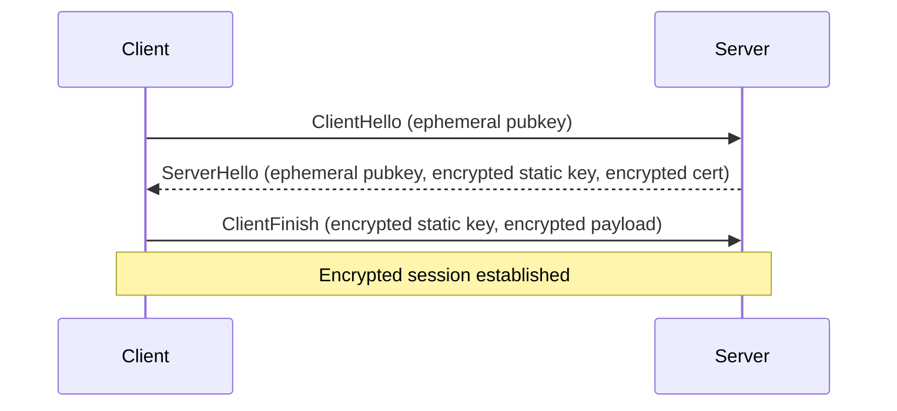
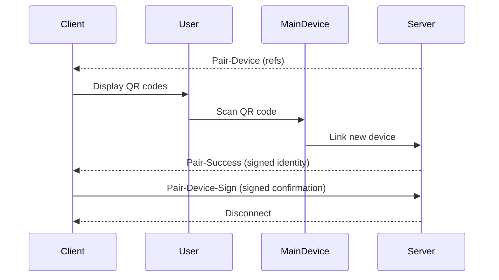

#  Initial Connection & QR Code Pairing: Technical Deep Dive

---

## Overview

This document details the **initial connection process** of , including the **Noise handshake** and **QR code-based authentication workflow**. It explains each step, underlying cryptographic mechanisms, data flows, security considerations, error handling, and provides diagrams for clarity.

---

## 1. Noise Protocol Handshake

### Purpose
Establish a mutually authenticated, encrypted session over WebSocket using the Noise_XX_25519_AESGCM_SHA256 handshake.

### Sequence

1. **Initialize Handshake**
   - Client generates ephemeral X25519 key pair.
   - Starts Noise handshake with XX pattern.

2. **ClientHello**
   - Client sends protobuf `HandshakeMessage` with ephemeral public key.
   - Sent unencrypted.

3. **ServerHello**
   - Server responds with:
     - Ephemeral public key
     - Encrypted static public key
     - Encrypted certificate chain

4. **Mix Ephemeral Keys**
   - Client mixes DH(client ephemeral private, server ephemeral public) into Noise key.

5. **Decrypt Server Static Key**
   - Client decrypts encrypted static key.
   - Mixes DH(client ephemeral private, server static public) into Noise key.

6. **Decrypt & Verify Certificate**
   - Client decrypts encrypted certificate.
   - Verifies:
     - Intermediate cert signed by WhatsApp root key.
     - Leaf cert signed by intermediate.
     - Leaf key matches decrypted static key.
     - Issuer serials match.

7. **ClientFinish**
   - Client encrypts its static Noise public key.
   - Mixes DH(client static private, server ephemeral public) into Noise key.
   - Encrypts client payload (device info).
   - Sends encrypted static key + payload.

8. **Session Established**
   - Both derive final session keys.
   - Encrypted communication begins.

### Diagram



### Security

- **Mutual authentication** via Noise static keys and certificate chain.
- **Forward secrecy** via ephemeral keys.
- **Certificate pinning** to WhatsApp root key.
- **Confidentiality & integrity** via AES-GCM.

### Error Handling

- Timeout waiting for server response.
- Decryption failures.
- Certificate verification failures.
- Missing/invalid handshake parts.

---

## 2. QR Code Pairing & Authentication

### Purpose
Authenticate a new device by linking it to an existing WhatsApp account via QR code scan.

### Sequence

1. **Server Sends Pair-Device Request**
   - Contains multiple `<ref>` strings.

2. **Generate QR Code Data**
   - For each `ref`, client constructs:
     ```
     ref,base64(client Noise pubkey),base64(client Identity pubkey),base64(ADV secret key)
     ```
   - Displayed as QR codes.

3. **User Scans QR Code**
   - Main device scans QR code.
   - Initiates device linking with WhatsApp servers.

4. **Server Sends Pair-Success**
   - Contains:
     - Signed, HMAC-protected device identity
     - Business info
     - Device JIDs
     - Platform info

5. **Verify Device Identity Container**
   - Parse `ADVSignedDeviceIdentityHMAC`.
   - Verify HMAC with ADV secret key.
   - Parse inner `ADVSignedDeviceIdentity`.

6. **Verify Signatures**
   - Check account signature using client's Identity key.
   - Generate device signature and attach.

7. **Extract Device Details**
   - Parse `ADVDeviceIdentity`.
   - Save device identity, JIDs, business info, platform info.

8. **Acknowledge Pairing**
   - Marshal self-signed device identity.
   - Send `<pair-device-sign>` IQ stanza with signed identity.

9. **Persist State**
   - Save updated store.
   - Map LID to JID.
   - Store main device's Signal identity.

10. **Expect Disconnect**
    - Server disconnects client after pairing.
    - Client expects this and suppresses disconnect event.

### Diagram



### Security

- **QR code contains ephemeral Noise key, Identity key, ADV secret key.**
- **Main device verifies and signs new device identity.**
- **HMAC protects device identity container.**
- **Signatures ensure authenticity.**
- **Client verifies all signatures before accepting.**

### Error Handling

- Invalid/missing QR refs: logs warning, skips.
- HMAC mismatch: aborts with unauthorized error.
- Signature verification failure: aborts with unauthorized error.
- Parsing/marshalling errors: aborts with internal error.
- Database save failures: aborts with internal error.
- Pairing confirmation send failure: cleans up store, aborts.

---

## 3. Summary

This document provides a **step-by-step, in-depth explanation** of 's initial connection and authentication process, covering:

- Noise handshake with certificate verification
- QR code-based device pairing
- Underlying cryptographic mechanisms
- Data and control flows
- Security considerations
- Error handling strategies

It serves as a precise blueprint for implementing or understanding the secure onboarding workflow in .